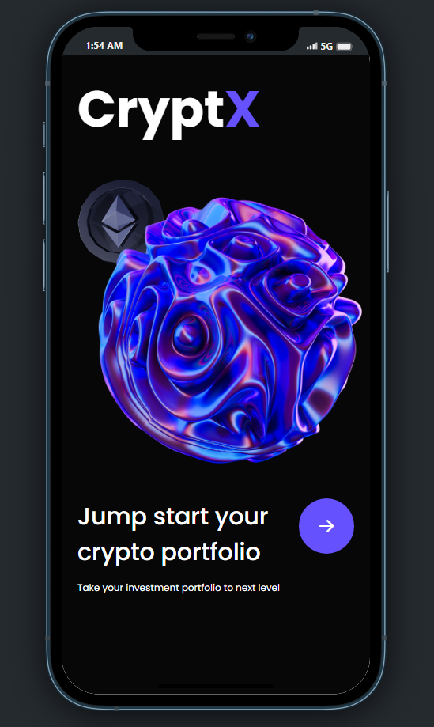
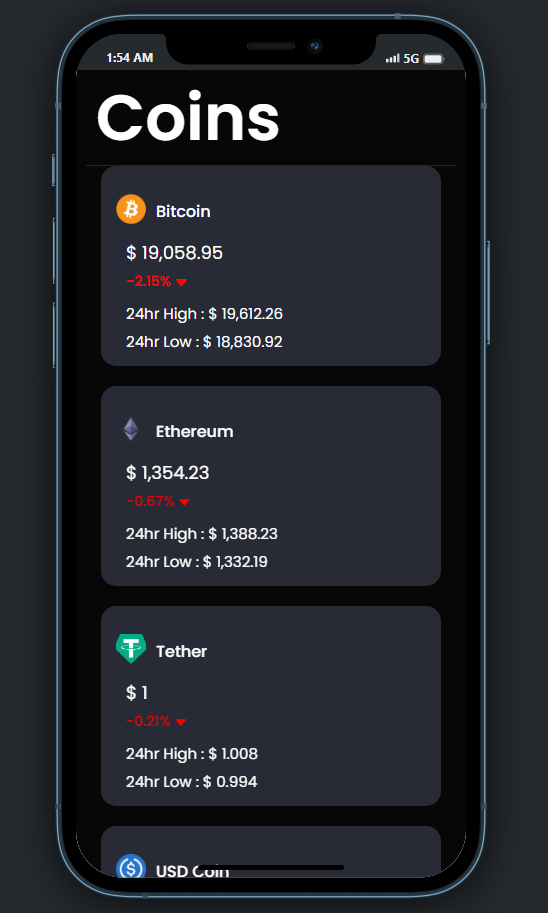
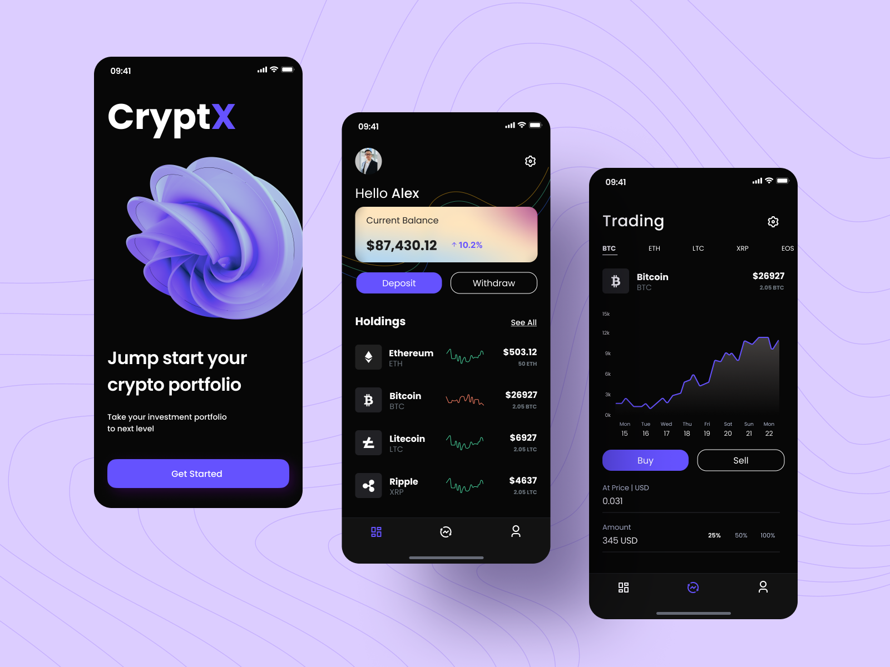

# CryptX

Track prices of crypto in real time...

Demo of the app : https://expo.dev/@karthik1879/cryptoX?serviceType=classic&distribution=expo-go

Install Expo Go application from playstore to run the App.

ScreenShots of the App : 







## Installation

If you are cloning the project then run this first

```sh
git clone https://github.com/Aradhya1905/CryptX.git
```

Make sure you have node.js installed ,then run "yarn install"

```sh
yarn install
```

For Development :

```sh
npx expo start
```
then choose either Android / IOS based on your device.

App design was inpired from a figma design file : https://www.figma.com/file/5rrh1QkEwPrRxoL3mMkEFY/Crypto-wallet---Mobile-app-(Community)?node-id=1%3A217



News data was obtained from News API : https://newsapi.org/

### Real time crypto prices were obtained from CoinGecko API : https://www.coingecko.com/en/api/documentation

To Do's : Charts need to be incorporated into the App.
